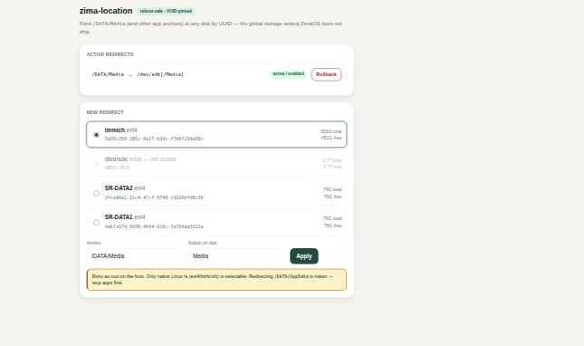

# zima-location

**Redirect where your ZimaOS / CasaOS apps store their data — once, for all apps — reboot-safe and disk-letter-proof.**



## The problem

On ZimaOS / CasaOS every app from the store hard-codes its host paths to the
system disk: `/DATA/AppData/<app>` for config and `/DATA/Media` for media. There
is **no global setting** to say "put app data / media on my big disk instead."
Your only official option is editing each app's volume paths by hand, one app at
a time — and every new install resets to `/DATA/...` again.

## The idea

Every app points at the **same two anchors** (`/DATA/Media`, `/DATA/AppData`).
So you redirect the anchor **once** and every present *and future* app follows
automatically. `zima-location` bind-mounts an anchor onto a subdirectory of a
disk you choose — and does it **safely across reboots**.

## Why it's safe across reboots

ZimaOS mounts data disks under **letter paths** (`/media/sdb`) that can **change
after a reboot** (e.g. plugging in a USB stick shifts the SATA letters). A naive
bind to `/media/sdb/...` becomes a time bomb: after the letter shifts, the anchor
points at nothing.

`zima-location` never hardcodes a letter. It installs a small `oneshot` systemd
service that, **at every boot**, resolves the disk by its **UUID** to wherever it
is currently mounted (`findmnt -S UUID=...`) and then binds. If the letter moved,
it follows. This was verified on real hardware: after a reboot the target disk
moved from `/dev/sdd` to `/dev/sdb`, and `/DATA/Media` stayed correctly bound.

## Requirements

- ZimaOS / CasaOS (needs `/DATA`, `systemd`, `findmnt`, root)
- A target disk formatted **ext4 / btrfs / xfs**. exFAT / NTFS / FAT are
  **rejected**: a non-root container (uid 1000) cannot `chown` them, so apps
  can't use a prepared folder there.

## Install

```bash
curl -fsSL https://raw.githubusercontent.com/chicohaager/zima-location/main/install.sh | sudo bash
```

or from a checkout:

```bash
git clone https://github.com/chicohaager/zima-location
cd zima-location && sudo ./install.sh
```

Files land in `/etc/zima-location/`.

## Usage

```bash
# 1. See your ext4/btrfs disks and their UUIDs
sudo /etc/zima-location/zima-location.sh list-disks

# 2. Redirect /DATA/Media to <UUID>/Media on the chosen disk
sudo /etc/zima-location/zima-location.sh set /DATA/Media <UUID> Media

# 3. Restart any already-running app that mounts the anchor, so it picks it up
sudo docker restart <app>

# Check status / roll back anytime
sudo /etc/zima-location/zima-location.sh status
sudo /etc/zima-location/zima-location.sh rollback /DATA/Media
```

If the anchor already contained files, they are `rsync`-copied to the target and
the old folder is backed up next to it as `<anchor>.pre-zl` (nothing is deleted).

## How it works (under the hood)

- `set` writes a per-anchor unit `/etc/systemd/system/zima-location-<anchor>.service`
  (`Type=oneshot`, `RemainAfterExit=yes`, `After=local-fs.target`,
  `WantedBy=multi-user.target`).
- The unit runs `redirect.sh <anchor> <uuid> <subdir>`, which resolves the UUID
  to its live mountpoint (60s retry for late mounts) and `mount --bind`s it.
- `rollback` disables the unit, unmounts the anchor and removes the unit. Your
  data stays on the target disk.

## Optional web UI

A small browser UI (pick a disk → Apply / Rollback) is included under `ui/`.
It needs **python3** on the host (the CLI itself does not).

```bash
sudo /etc/zima-location/ui/install-ui.sh 9797   # from the repo: sudo ui/install-ui.sh
```

> ⚠️ **Security:** the UI backend runs as **root**. It **binds `127.0.0.1` by
> default** — reach it via an SSH tunnel (`ssh -L 9797:localhost:9797 <host>`).
> Requests are guarded against DNS-rebinding / cross-site POST (Host + Origin
> checks). To expose it on the LAN set `ZL_BIND=0.0.0.0` (and ideally
> `ZL_TOKEN=<secret>`) before running `install-ui.sh` — at your own risk, behind
> the ZimaOS firewall. Don't expose an unauthenticated root service to an
> untrusted network.

## Notes & caveats

- **`/DATA/Media` is the safe, recommended anchor.** Redirecting `/DATA/AppData`
  is possible but riskier (live databases, permissions, ZimaOS services that
  index AppData) — do it deliberately, with apps stopped.
- The redirect is a **bind mount**, so it shares a disk. To *dedicate* a whole
  disk instead, a device mount is simpler — not this tool's job.
- Not affiliated with IceWhale. Use at your own risk; test `rollback` first.

## License

Licensed under either of

- Apache License, Version 2.0 ([LICENSE-APACHE](LICENSE-APACHE))
- MIT license ([LICENSE-MIT](LICENSE-MIT))

at your option. Unless you explicitly state otherwise, any contribution
intentionally submitted for inclusion in this work shall be dual licensed
as above, without any additional terms or conditions.
